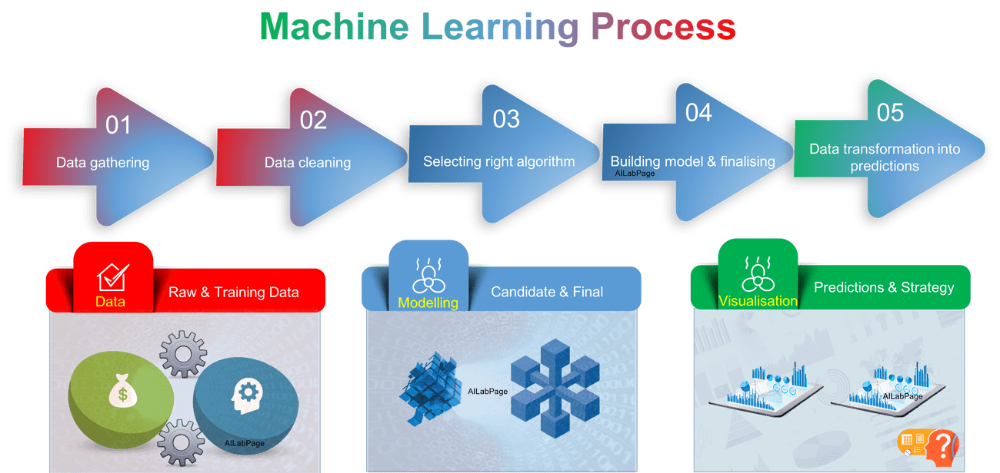

# MachineLearningUsingPython  
  
Machine Learning is a latest __buzzword__ floating around. It desrves to, as it is one of the most interesting subfield of Computer Science. 
__What does Machine Learning really means?__ 
Machine Learning is an application of artificial intelligence(AI) that provides systems the ability  to automatically learn and improve from experience without being explicitly programmed.__Machine Learning focuses on the development of computer programs__ that can access data and use it to learn for themsleves. 
The process of learning begins with data, such as, direct experience, or instruction, in order to look for patterns in data and make better decisions in the future based on the examples that we provide. __The primary aim is to allow the computers learn automatically__ without human intervention or assistance and adjust actions accordingly. 
  

## Repository Overview
This repository is about different Machine Learning algorithm approaches as per the industry practices.
## Table of Contents
- [Hr Analytics](#section1) 
- [Credit Fraud Detection](#section2) 
- [Telecom Churn Prediction](#section3) 

___

### [Hr Analytics](./Employeechurn)
  
- Employee churn is the overall turnover in an organization's staff as existing employees leave and new ones are hired. 
- The churn rate is usually calculated as the percentage of employees leaving the company over some specified time period.
- some staff turnover is inevitable, a high rate of churn is costly. Recruitment, hiring and training all require a financial outlay and a new hire may not be immediately productive in terms of creating profit
- An effort to build a model which helps in reducing the churn rate for a company.

___

### [Credit Fraud Detection](./CreditCardFraud)
  
- Credit card fraud is a wide-ranging term for __theft__ and __fraud committed__ using or involving a payment card, such aas credit or debit card, as  __fraudulent source__ of funds in a transaction. 
- The purpose may be to obtain goods without paying, or to obtain __unautorized funds from an account__.
- Credit card fraud is also and adjunt to __identity__ theft.
- Building a robust model so that credit card companies are able to recognize the fraudulent card transactions so that customets are not charged for items that they did not purchase.

___

### [Telecom Churn Prediction](./TelecomChurn)
  
- A churn with respect to the Telecom industry, is defined as the percentage of __subscribers moving__ from a specific service to a service provider to another in a period of time.
- Research shows that the companies have an __avergae churn of 1.9 to 2 percent__ month on month and annualized churn ranging from 10 to 60 percent.
- An effort to build a model which helps in reducing the churn rate for a telecom company.

## Projects in execution

SIC Databasehttp://www.siclists.com › california › beale-afbhttp://www.siclists.com › california › b
SIC Code 3484 and NAICS Code 332994.Missing: CHELTENHAM ‎| Must include: CHELTENHAMnaics code 928110
SIC Code: 922304 - City Govt-Correctional Institutions; SIC Category: Justice, Public Order and Safe
SIC Code 8322 and NAICS Code 624190.data center sic codecall center sic codesic code 73899999sic cod
SIC CodeSearch instead for VERMONT NATIONAL AIRGUARD SIC CodeSearch ResultsWeb resultsVermont Army N
SIC Code 92,922. NAICS Code 92212,9221. Show More. Popular Searches: Portsmouth Police Department. T
SIC Code 6282 - Investment Advice and NAICS Code 523930 - Investment Advice.Fredericks Michael And C
SIC) ...hawthorne army depot addresshawthorne army depot phone numbershawthorne army depot base hous
SIC Code 92. NAICS Code 9221,922. Show More. Popular Searches: newport chemical depot ...Newport Che
SIC Code 3482 - Small arms ammunitionhttps://siccode.com › SIC Lookup › 20-39 Hierarchyhttps://sicco
SIC Code 8711 - Engineering serviceshttps://siccode.com › SIC Lookup › 70-89 Hierarchyhttps://siccod
SIC ‎Codelist of army reserve units by statearmy reserve deployment schedule 2021list of reserve for
SICK LEAVE.13 pagescop codesnyc 911 call lognypd codes3-8 police code world trade centerpolice scann
SIC Code Search ResultsWeb resultsGreen Haven Correctional Location:Stormville,New York,USA ...http:
SIC 9711https://siccode.com › ... › NAICS 928110 Detailshttps://siccode.com › ... › NAICS 928110 Det
SIC Industry: 8711 Engineering Services | NAICS Associationhttps://www.naics.com › sic-industry-desc
